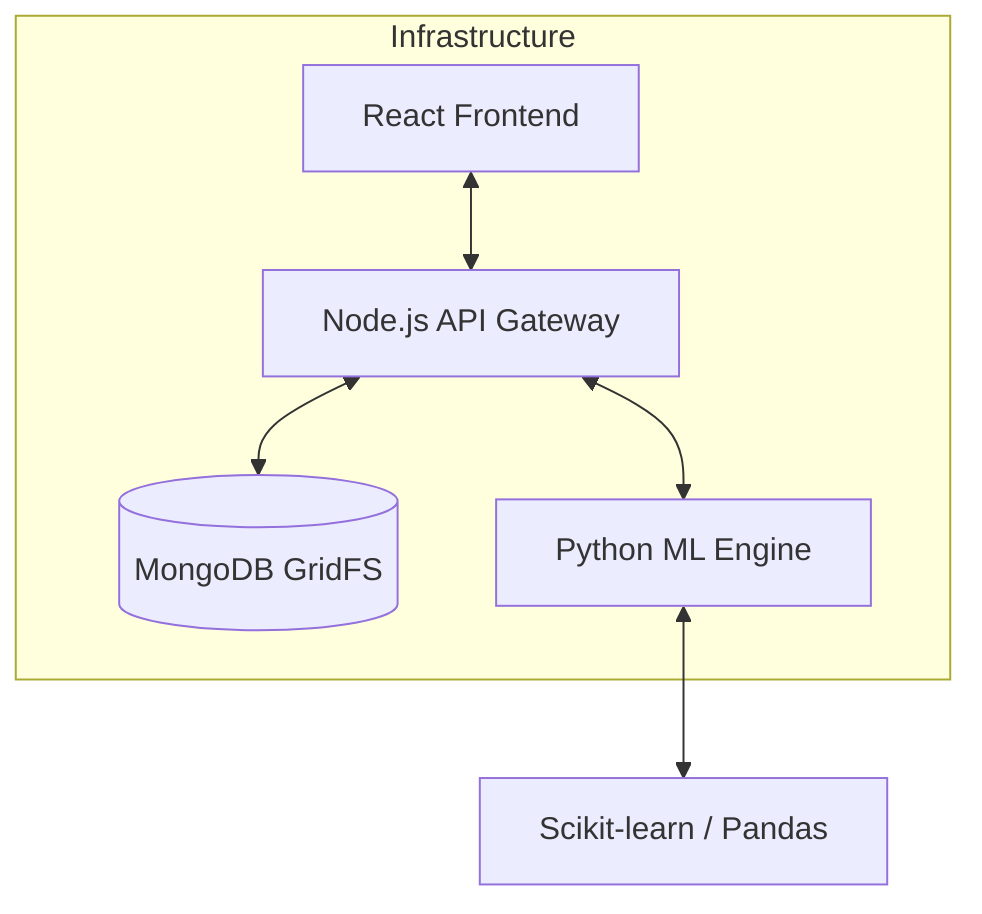

# 🧪 ModelLab — Interactive Machine Learning Model Builder
> **Unleash the Power of AI. No Code Required. Visual. Direct. Powerful.**

[](https://modellab-frontend.vercel.app/)
[](https://modellab-backend.onrender.com)
[](https://opensource.org/licenses/MIT)

**ModelLab** is a state-of-the-art interactive platform designed to bridge the gap between complex data science and user-friendly web interfaces. Whether you are a student learning the fundamentals of AI or a developer looking to prototype models quickly, ModelLab provides a seamless pipeline to **Upload, Explore, Train, and Predict** in real-time.

---

## ✨ Core Features

🎨 **Futuristic UI/UX**  
Experience a high-end, neon-based design with glassmorphism and smooth micro-animations using Framer Motion.

📊 **Interactive Data Exploration**  
Understand your datasets before training. Visualize schemas, calculate statistics, and identify correlation patterns instantly.

⚡ **Real-Time ML Engine**  
Connect directly to a Python-based machine learning service that trains models using standard industry protocols through persistent binary streams.

🧠 **Dynamic Model Builder**  
Select from multiple algorithms (Random Forest, KNN, Decision Trees, Regressions) and configure your target variables with simple toggles.

🔮 **Inference Marketplace**  
Test your models instantly. Enter new inputs and get predictions returned from your trained artifacts with full metric transparency.

---

## 🛠️ Technology Stack

ModelLab utilizes a sophisticated hybrid architecture combining the flexibility of JavaScript with the computational power of Python.

| Layer | Technology |
| :--- | :--- |
| **Frontend** | React 18, Tailwind CSS, Framer Motion, Phosphor & Lucide Icons |
| **Backend API** | Node.js, Express.js, JWT Authentication |
| **Database** | MongoDB Atlas with GridFS (Diskless Architecture) |
| **ML Engine** | Python 3.9+, Scikit-learn, Pandas, NumPy, FastAPI |
| **DevOps** | Vercel (Frontend), Render (Microservices), Git |

---

## 📐 Architecture Diagram



---

## 🚀 How It Works (Step-by-Step)

1.  **Identity Control**: Register or login to your private laboratory account secured with JWT encryption.
2.  **Artifact Ingestion**: Upload a CSV dataset. The system instantly structures the telemetry and stores it in MongoDB GridFS.
3.  **Spectrum Analysis**: Explore the dataset dimensions, row counts, and schema distributions.
4.  **Neural Training**: Select your algorithm (Classification vs Regression). The Node.js backend pipes the data directly into the Python ML service.
5.  **Compute Phase**: Scikit-Learn processes the binary stream, trains the model, and calculates performance metrics (Accuracy, F1, R², MSE).
6.  **Registry**: The trained model artifact is saved back to GridFS for permanent access.
7.  **Simulation**: Use the "Test" interface to input fresh data and witness the model predict outcomes live.

---

## 💻 Local Installation Guide

Clone the repository and follow these steps to set up your local laboratory:

### 1. Prerequisites
- Node.js (v18+)
- Python (3.9+)
- MongoDB Atlas account (for connection string)

### 2. Backend Setup (Node.js)
```bash
cd server
npm install
# Create .env based on the "Environment Variables" section below
npm start
```

### 3. ML Service Setup (Python)
```bash
cd ml-service
python -m venv venv
source venv/bin/activate # Windows: venv\Scripts\activate
pip install -r requirements.txt
python main.py
```

### 4. Frontend Setup (React)
```bash
cd client
npm install
npm run dev
```

---

## 🔑 Environment Variables

To keep the platform secure and functional, configure these `.env` files:

### `server/.env`
```env
PORT=5000
MONGODB_URI=your_mongodb_atlas_uri
JWT_SECRET=your_secret_key
ML_SERVICE_URL=http://localhost:8000 # Production: Render URL
```

### `client/.env`
```env
VITE_API_URL=http://localhost:5000/api # Production: Backend URL
```

---

## 🌐 Deployment Architecture

ModelLab is optimized for a **full cloud-native deployment**:

- **[Frontend (Vercel)](https://modellab-frontend.vercel.app/)**: Edge-cached React production build with optimized SPA routing.
- **[Backend API (Render)](https://modellab-backend.onrender.com)**: Persistent Node.js instance managing service orchestration.
- **[ML Service (Render)](https://modellab-ml-service.onrender.com)**: High-performance Python service for raw computational workloads.
- **Persistence (MongoDB Atlas)**: Globally distributed NoSQL cluster with GridFS storage.

---

## 📸 Screenshots & Previews

> *Placeholders - Add your high-quality screenshots here!*

| Laboratory Dashboard | Neural Model Builder |
| :--- | :--- |
|  |  |

---

## 🔮 Future Enhancements

- [ ] Support for **TimeSeries** and **Image Classification**.
- [ ] Integration of **AutoML** (Hyperparameter auto-tuning).
- [ ] Export models as `.pkl` or `.onnx` for external use.
- [ ] Collaborative Laboratory spaces for team research.

---

## 🧑‍🔬 Author

**Guru Goutham Kanchi**  
Lead Developer & AI Enthusiast  
[GitHub Profile](https://github.com/GuruGouthamKanchi)

---

## ⚖️ License

Distributed under the MIT License. See `LICENSE` for more information.

---
**ModelLab** — Built with ❤️ for the future of AI Education.
